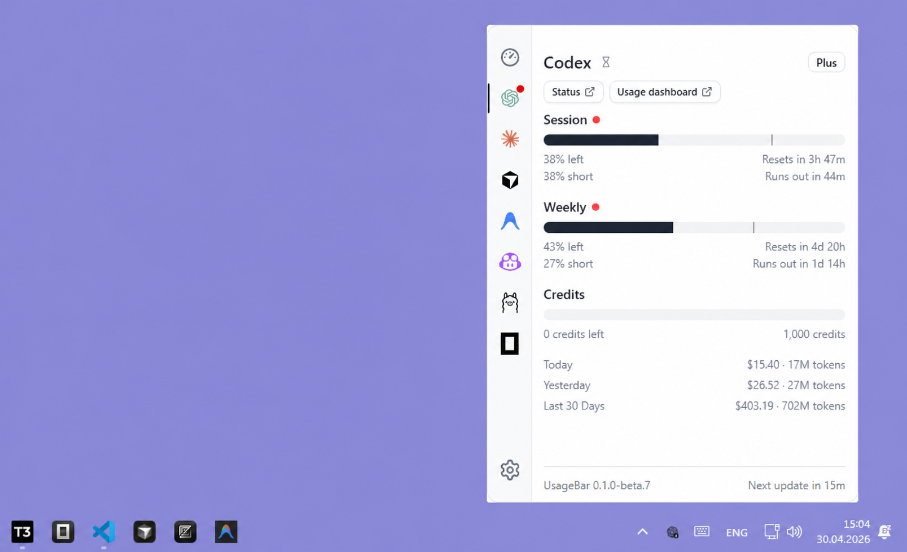

# UsageBar

Windows-first tray app for tracking AI coding subscription usage across providers in one place.

UsageBar is a fork of [OpenUsage](https://github.com/robinebers/openusage), redirected toward a Windows-native desktop experience instead of preserving upstream compatibility as the main constraint.



## Download

The first public Windows beta is prepared as a GitHub prerelease.

Release plan:
- Windows: GitHub prerelease with a NSIS setup `.exe`
- macOS: still secondary while the Windows fork stabilizes

Until the beta tag is published:
- Build from source (see "Build from source" below).
- Or follow the upstream project releases if you just want something stable: [OpenUsage releases](https://github.com/robinebers/openusage/releases).

Release process and preflight checks live in [docs/releasing.md](docs/releasing.md).

## What It Does

UsageBar lives in your Windows tray and shows you how much of your AI coding subscriptions you've used. Progress bars, badges, and clear labels. No dashboard hopping.

- **One glance.** All your AI tools, one panel.
- **Always up-to-date.** Refreshes automatically on a schedule you pick.
- **Global shortcut.** Toggle the panel from anywhere with a customizable keyboard shortcut.
- **Lightweight.** Opens instantly, stays out of your way.
- **Plugin-based.** New providers get added without updating the whole app.
- **Local HTTP API.** Read cached usage from `127.0.0.1:6736` for local widgets, scripts, and dashboards.
- **Proxy support.** Route requests through SOCKS5/HTTP proxies for restricted networks.
- **Custom OAuth.** Bring your own OAuth credentials for enterprise compliance.

## Providers

Current Windows rollout status comes from each provider's `plugin.json` manifest in this fork.

| Provider | Windows status | Scope |
|---|---|---|
| [**Alibaba Coding Plan**](docs/providers/alibaba.md) | Experimental | Coding Plan daily/weekly quotas with region-aware auth |
| [**Amp**](docs/providers/amp.md) | Experimental | Free tier, bonus, credits |
| [**Antigravity**](docs/providers/antigravity.md) | Supported | All models |
| [**Augment**](docs/providers/augment.md) | Experimental | Credits via signed-in Augment web Cookie header |
| [**Claude**](docs/providers/claude.md) | Supported | Session, weekly, extra usage, local token usage (`ccusage`) |
| [**Codex**](docs/providers/codex.md) | Supported | Session, weekly, reviews, credits, managed multi-account selection |
| [**Copilot**](docs/providers/copilot.md) | Experimental | Premium, chat, completions |
| [**Cursor**](docs/providers/cursor.md) | Supported | Credits, total usage, auto usage, API usage, on-demand, CLI auth |
| [**Factory / Droid**](docs/providers/factory.md) | Experimental | Standard and premium usage buckets |
| [**Gemini**](docs/providers/gemini.md) | Experimental | Gemini quota buckets and reported Code Assist tier |
| [**JetBrains AI Assistant**](docs/providers/jetbrains-ai-assistant.md) | Supported | Quota, remaining |
| [**Kilo**](docs/providers/kilo.md) | Experimental | Direct API-key usage endpoint |
| [**Kimi Code (Moonshot)**](docs/providers/kimi.md) | Experimental | Kimi CLI, kimi.com membership, session and weekly quota from local `kimi login` OAuth; optional official Moonshot API balance via `https://api.moonshot.ai/v1/users/me/balance` |
| [**Kiro**](docs/providers/kiro.md) | Experimental | Credits, bonus credits, overages tracking |
| [**MiniMax**](docs/providers/minimax.md) | Experimental | Coding Plan session usage, explicit reported plan when available |
| [**Ollama**](docs/providers/ollama.md) | Supported | Plan, session, weekly |
| [**OpenCode Zen**](docs/providers/opencode.md) | Experimental | Pay-as-you-go billing usage from the signed-in workspace session |
| [**OpenCode Go**](docs/providers/opencode-go.md) | Supported | Subscription 5h, weekly, monthly limit tracking from local CLI history |
| [**OpenRouter**](docs/providers/openrouter.md) | Experimental | Credits, balance, request-rate detail |
| [**Perplexity**](docs/providers/perplexity.md) | Experimental | Recurring, purchased, and bonus credit pools via manual cookie/env auth |
| [**Synthetic**](docs/providers/synthetic.md) | Experimental | Direct API-key quota endpoint |
| [**Vertex AI**](docs/providers/vertex-ai.md) | Experimental | gcloud ADC OAuth plus Cloud Monitoring quota usage |
| [**Warp**](docs/providers/warp.md) | Experimental | Request limits, plan badge |
| [**Windsurf**](docs/providers/windsurf.md) | Experimental | Daily quota, weekly quota, extra usage balance |
| [**Zed**](docs/providers/zed.md) | Experimental | Dashboard token spend via browser-backed cookie replay, with local telemetry fallback |
| [**Z.ai**](docs/providers/zai.md) | Experimental | Session, weekly, web searches |

Want a provider that's not listed? [Open an issue.](https://github.com/Loues000/usagebar/issues/new)

## Fork Direction

This repository is no longer trying to stay narrowly aligned with upstream pull-request boundaries. The priority here is a clean Windows tray app, a plugin-first provider model, and pragmatic product decisions for this fork.

That means the fork can change UX, provider strategy, release packaging, and architecture when that is the right tradeoff for Windows.

Upstream lineage stays visible and upstream fixes can still be pulled in through `upstream`, but this repository should be read as its own product direction.

## Contributing

- **Add a provider.** Each one is just a plugin. See the [Plugin API](docs/plugins/api.md).
- **Read usage locally.** See the [Local HTTP API](docs/local-http-api.md).
- **Fix a bug.** Keep the change small, focused, and verified.
- **Request a feature.** [Open an issue.](https://github.com/Loues000/usagebar/issues/new) Include the provider, auth source, and Windows-specific constraints.

Keep it simple. No feature creep, no AI-generated commit messages, test your changes.

## Lineage

UsageBar started from the [OpenUsage](https://github.com/robinebers/openusage) codebase. This fork also borrows practical Windows ideas from [CodexBar](https://github.com/steipete/CodexBar) and provider reference patterns from [ccusage](https://github.com/ryoppippi/ccusage) where they fit.

## Credits

Inspired by [CodexBar](https://github.com/steipete/CodexBar) by [@steipete](https://github.com/steipete). Same idea, very different approach.

## License

[MIT](LICENSE)

---

<details>
<summary><strong>Build from source</strong></summary>

> **Warning**: The `main` branch may not be stable. It is merged directly without staging, so users are advised to use tagged versions for stable builds. Tagged versions are fully tested while `main` may contain unreleased features.

### Stack

- Tauri v2
- Rust
- React 19
- TypeScript
- Vite
- Tailwind CSS v4
- Zustand
- Vitest

### Local release build

For a Windows beta-style build on this machine:

```bash
bun run release:check -- --release-tag v0.1.0-beta.3
bun run build:release -- --bundles nsis
```

If `TAURI_SIGNING_PRIVATE_KEY` is unset, the helper automatically adds `--no-sign` for an unsigned local build. The setup executable lands under `src-tauri/target/release/bundle/nsis/`.

Before pushing a release tag, run the same preflight with `--require-clean` so the tag is cut from a clean worktree.

</details>
